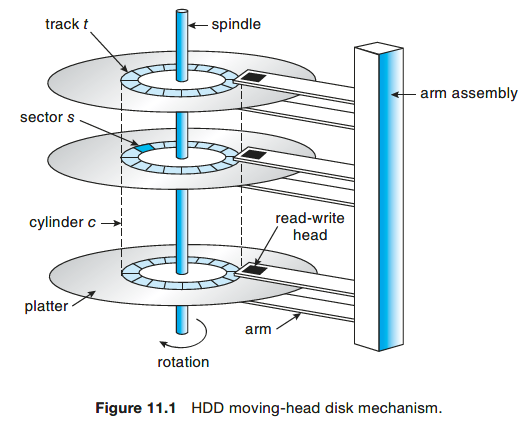
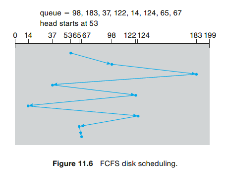
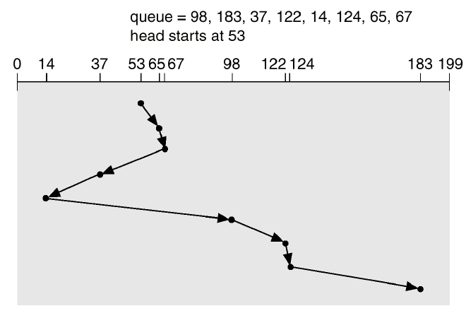
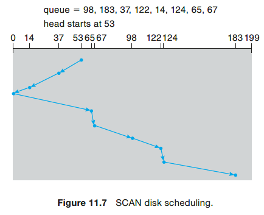
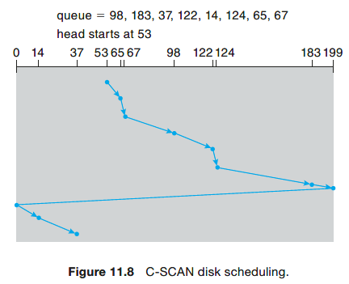

# Module 10 - Mass Storage Structure (Chapter 11)

## Hard Disk Drive (HDD)
* Structure: Each disk **platter** has a flat circular shape. A **read–write head** “flies” just above each surface of every platter. The heads are attached to a **disk arm** that moves all the heads as a unit. The surface of a platter is logically divided into circular **tracks**, which are subdivided into **sectors**. The set of tracks at a given arm position make up a **cylinder**.  
    

## HDD Scheduling
1. Whenever a process needsI/O to or from the drive, it issues a system call to the operating system. The request specifies several pieces of information:
    * Whether this operation is input or output
    * The open file handle indicating the file to operate on
    * What the memory address for the transfer is
    * The amount of data to transfer
2. Parameters to consider:
    * **Seek time (Positioning time)**: the time taken for the disk drive to position itself on the desired cylinder.
    * **Rotation latency time**: the time taken by the read-write head which is on the correct cylinder to position yourself on the desired sector.
    * **Reading time**: time needed to read the track

### FCFS Scheduling
The simplest form of disk scheduling is, of course, the first-come, first-served (FCFS) algorithm (or FIFO).  

* Total movement: 640 = 45 + 85 + 146 + 85 + 108 + 110 + 59 + 2
* Average: 80 = 640 / 8

### SSTF Scheduling
SSTF = Shortest Seek Time First. Selects the request with the minimum seek time from the current head position. Better than FCFS. **Problem**: this algorithm is *not optimal and can cause famine*!  

* Total movement: 236 = 12 + 2 + 30 + 23 + 84 + 24 + 2 + 59
* Average: 29.5 = 236 / 8

### SCAN Scheduling
In the SCAN algorithm (elevator), the disk arm starts at one end of the disk and moves toward the other end, servicing requests as it reaches each cylinder, until it gets to the other end of the disk. At the other end, the direction of head movement is reversed, and servicing continues. The head continuously scans back and forth across the disk. *Avoid famine, while still efficient*! **Problem**: Not much work to do when reversing directions, since requests will have accumulated at the other end of the disk.  

* Total movement: 236 = 53 + 183
* Average: 29.5 = 236 / 8

### C-SCAN Scheduling
The head moves from one end of the disk to the other, servicing requests as it goes. When it reaches the other end, however, it immediately returns to the beginning of the disk, <u> without servicing any requests on the return trip </u>. The return trip is relatively fast, as it does not need to accelerate/decelerate for each request.  

* Total movement: 183 = 146 + 37 (without return) or 382 = 183 + 199 (with return)
* Average: 22.875 (without return) or 47.75(with return); normally the return will be quick so actual cost will be between the two.

### C-LOOK Scheduling
Same idea as C-SCAN, but instead of going back to
the leftmost or rightmost cylinder, going back to the first cylinder
that has a query.  

* Total movement: 153 (without return) or 322 (with return)
* Average: 19.1 (without return) or 40.25 (with return); normally the return will be quick so actual cost will be between the two.